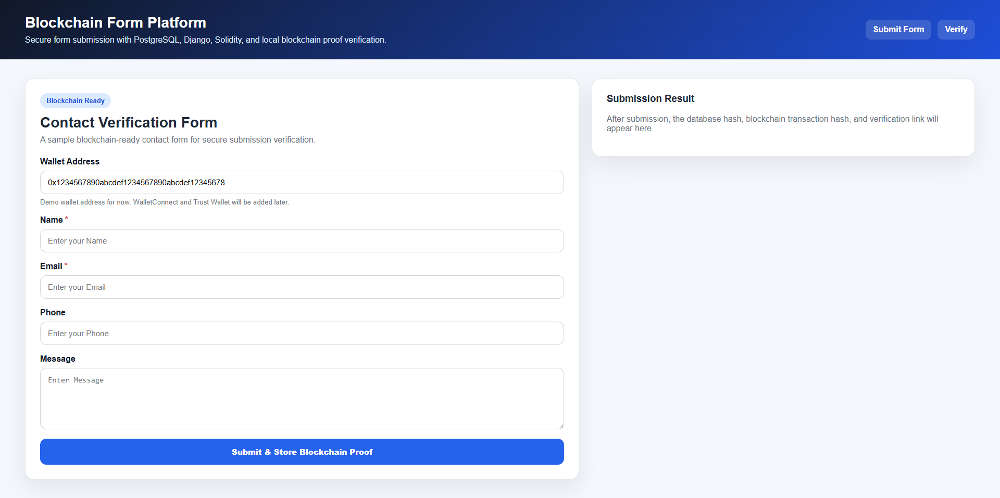
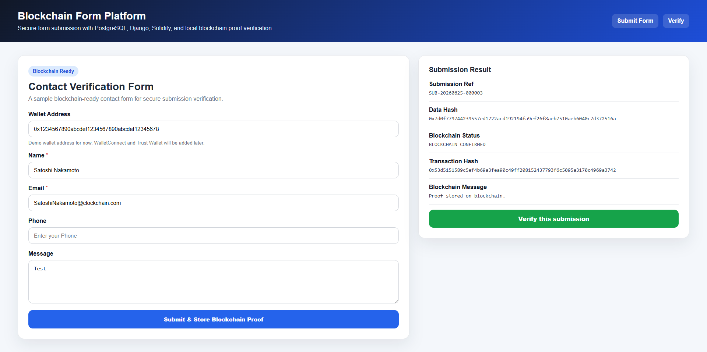
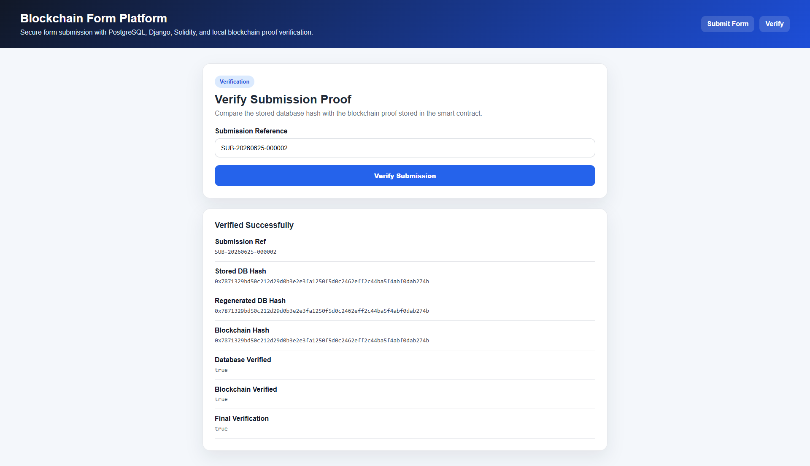
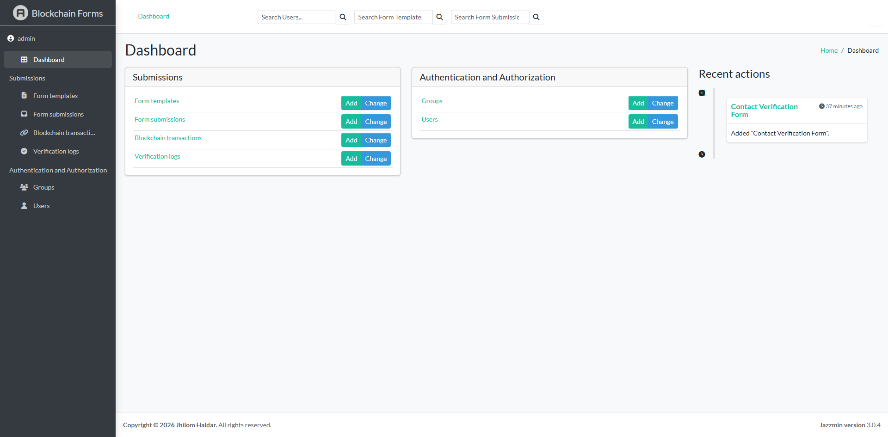
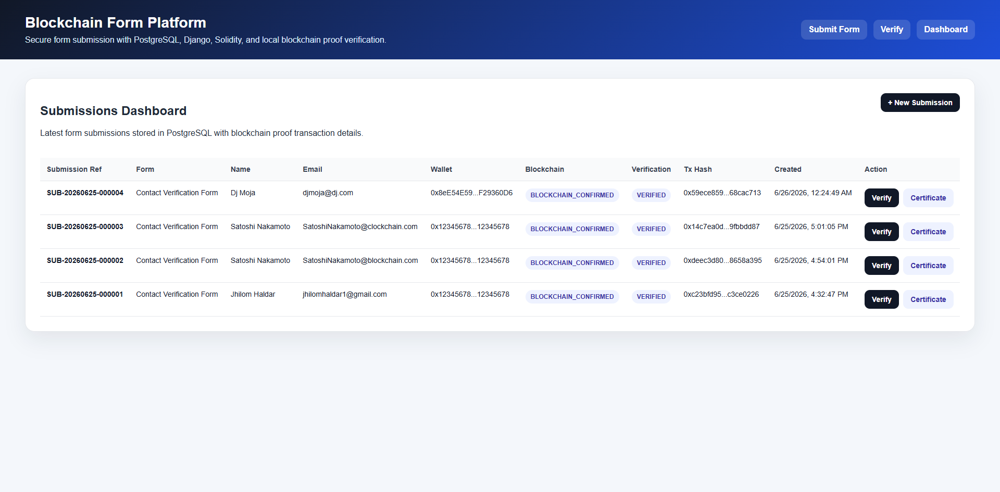
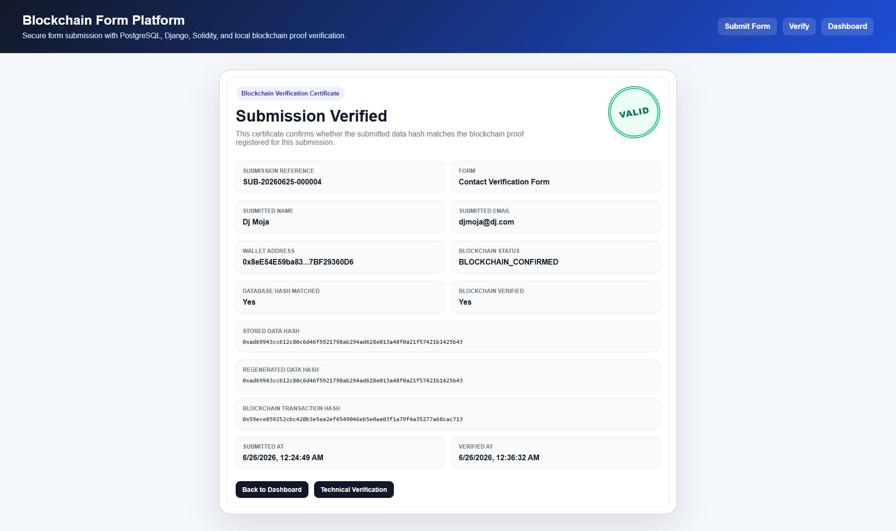

# Blockchain-Powered Form Submission Platform

A local-first full-stack blockchain-powered form submission, wallet connection, dashboard, and verification certificate platform built with **Python, Django REST Framework, PostgreSQL, React, Solidity, Hardhat, Web3.py, WalletConnect, and Trust Wallet support**.

This project demonstrates how traditional web applications can be combined with blockchain-based proof storage to make form submissions tamper-verifiable while keeping the actual submitted data private.

---

## Project Purpose

Traditional form submissions are usually stored only in centralized databases. If a record is modified later, it can be difficult to prove what the original submitted data was.

This project solves that problem by:

1. Storing the actual submitted form data in PostgreSQL.
2. Creating a deterministic SHA-256 hash of the submitted data.
3. Storing that hash on a Solidity smart contract.
4. Saving the blockchain transaction hash with the database record.
5. Allowing later verification by comparing the regenerated database hash with the blockchain proof.
6. Showing a public certificate-style verification page for valid submissions.

The submitted data remains private in PostgreSQL, while the blockchain stores only a tamper-verifiable proof.

---

## Current Project Status

This project currently runs fully on a local Windows development machine.

Current working flow:

```text
WalletConnect / Trust Wallet
→ React Frontend
→ Django REST API
→ PostgreSQL Database
→ SHA-256 Hash Generation
→ Web3.py Blockchain Service
→ Local Hardhat Blockchain
→ Solidity Smart Contract
→ Blockchain Verification API
→ React Verification Page
→ Public Verification Certificate
→ Printable / Shareable Certificate with QR Code
```

Current blockchain transaction model:

```text
Connected wallet address is attached to the form submission.
Backend local Hardhat account submits the proof transaction to the local blockchain.
```

This keeps the local demo stable while still showing wallet connection, blockchain proof registration, dashboard review, certificate-based verification, printable certificate export, and QR-based certificate access.

---

## Key Features

- Dynamic form template management from Django admin
- Form field management
- Public form submission from React frontend
- WalletConnect wallet connection
- Trust Wallet connection through WalletConnect
- Connected wallet address attached to every form submission
- PostgreSQL-based form data storage
- SHA-256 hash generation for submitted data
- Solidity smart contract for proof registration
- Local Hardhat blockchain integration
- Web3.py-based backend blockchain transaction handling
- Blockchain transaction hash storage
- Submission verification API
- React technical verification page
- Public verification certificate page
- Printable certificate / Save as PDF support
- Copy certificate link action
- QR code on certificate page for scan-to-verify access
- Frontend submissions dashboard
- Dashboard action buttons for technical verification and certificate view
- Django management command to seed demo form data
- Django management command to re-register old local submissions into the current Hardhat contract
- Jazzmin-powered Django admin interface
- Full local setup documentation for recruiters and developers

---

## Screenshots

### Form Submission Page



### Blockchain Submission Result



### Verification Result



### Admin Panel



### Form Submission Dashboard



### Verification Certificate



> Optional recommended screenshot:
>
> - `screenshots/07-printable-certificate-with-qr.png`

---

## Technology Stack

### Backend

- Python
- Django
- Django REST Framework
- PostgreSQL
- Web3.py
- Django Jazzmin Admin
- python-decouple
- django-cors-headers

### Frontend

- React
- Vite
- Axios
- React Router DOM
- Reown AppKit
- WalletConnect
- Wagmi
- Viem
- TanStack Query
- qrcode.react

### Blockchain

- Solidity
- Hardhat
- Local Hardhat Network
- ethers.js
- Web3.py

### Database

- PostgreSQL local database

---

## Architecture

```text
User Browser
    |
    v
WalletConnect / Trust Wallet
    |
    v
React Frontend
    |
    v
Django REST API
    |
    v
PostgreSQL Database
    |
    v
SHA-256 Hash Service
    |
    v
Web3.py Blockchain Service
    |
    v
Solidity Smart Contract on Local Hardhat Blockchain
    |
    v
Verification API + Certificate Page
```

---

## How the Blockchain Proof Works

The platform does not store full form data on the blockchain.

Instead:

1. User connects a wallet using WalletConnect / Trust Wallet.
2. User submits form data from the React frontend.
3. Django validates and stores the submitted data in PostgreSQL.
4. Django normalizes the submitted JSON data.
5. Django generates a SHA-256 hash.
6. Django sends the submission reference, hash, and wallet address to the Solidity smart contract.
7. The smart contract stores the proof on the local blockchain.
8. The blockchain transaction hash is saved in PostgreSQL.
9. The frontend dashboard lists the submission and blockchain status.
10. The verification page compares the database hash with the blockchain proof.
11. The certificate page displays a public-style verification result.
12. The certificate can be printed, saved as PDF, copied as a link, or opened through a QR code.

Example:

```text
Submitted Data
→ Normalized JSON
→ SHA-256 Hash
→ Smart Contract Proof
→ Verification Result
→ Public Certificate
→ Printable / Shareable Certificate
```

---

## Why Only Hashes Are Stored On-Chain

The platform stores only hashes on-chain because:

- Blockchain data is public.
- Sensitive form data should not be publicly exposed.
- On-chain storage is expensive.
- Blockchain data is difficult to delete.
- Privacy-friendly architecture is better for real-world applications.

Actual form data stays in PostgreSQL.

Blockchain stores only the proof.

---

## Project Structure

```text
blockchain-form-platform/
│
├── backend/
│   ├── blockchain_form/
│   ├── submissions/
│   ├── manage.py
│   └── requirements.txt
│
├── frontend/
│   ├── src/
│   ├── package.json
│   └── vite.config.js
│
├── smart-contracts/
│   ├── contracts/
│   ├── scripts/
│   ├── test/
│   ├── hardhat.config.js
│   └── package.json
│
├── docs/
│   └── LOCAL_SETUP.md
│
├── screenshots/
│
├── README.md
└── .gitignore
```

---

## Smart Contract

The main Solidity contract is:

```text
smart-contracts/contracts/FormProofRegistry.sol
```

Main functions:

```solidity
submitProof(string submissionRef, bytes32 dataHash, address submitterWallet)
verifyProof(string submissionRef, bytes32 dataHash)
getProof(string submissionRef)
revokeProof(string submissionRef)
```

The contract stores:

```text
submission reference
data hash
submitter wallet
recorded by address
created timestamp
revoked status
```

---

## Backend APIs

### Get Form

```http
GET /api/forms/contact-verification-form/
```

### Submit Form

```http
POST /api/submissions/
```

Example request:

```json
{
  "form_slug": "contact-verification-form",
  "wallet_address": "0x1234567890abcdef1234567890abcdef12345678",
  "submitted_data": {
    "name": "Jhilom Haldar",
    "email": "test@example.com",
    "phone": "9007068919",
    "message": "This is a blockchain verified form submission."
  }
}
```

### Verify Submission

```http
GET /api/submissions/{submission_ref}/verify/
```

### Submissions Dashboard

```http
GET /api/submissions/dashboard/
```

### Public Verification Certificate

```http
GET /api/certificates/{submission_ref}/
```

---

## Frontend Pages

### Form Submission Page

```text
http://localhost:5173/forms/contact-verification-form
```

### Submissions Dashboard

```text
http://localhost:5173/dashboard
```

### Technical Verification Page

```text
http://localhost:5173/verify/{submission_ref}
```

### Public Verification Certificate Page

```text
http://localhost:5173/certificate/{submission_ref}
```

The certificate page includes:

```text
VALID / FAILED seal
Submission reference
Form name
Submitted name and email
Wallet address
Stored data hash
Regenerated data hash
Blockchain transaction hash
Submitted date
Verified date
QR code for scan-to-verify
Print / Save PDF button
Copy certificate link button
```

---

## Local Setup

Full local setup instructions are available here:

```text
docs/LOCAL_SETUP.md
```

Quick local run summary:

```bash
# Terminal 1: Local blockchain
cd smart-contracts
npm run node
```

```bash
# Terminal 2: Django backend
cd backend
source venv/Scripts/activate
python manage.py runserver
```

```bash
# Terminal 3: React frontend
cd frontend
npm run dev
```

Frontend URL:

```text
http://localhost:5173/forms/contact-verification-form
```

Backend admin URL:

```text
http://127.0.0.1:8000/admin/
```

---

## Demo Data

The project includes a Django management command to seed demo form data:

```bash
python manage.py seed_demo_data
```

This creates:

```text
Contact Verification Form
Name field
Email field
Phone field
Message field
```

---

## WalletConnect / Trust Wallet

The frontend uses Reown AppKit / WalletConnect.

A Reown Project ID is required in the frontend `.env` file:

```env
VITE_REOWN_PROJECT_ID=your_reown_project_id_here
```

The connected wallet address is sent to Django with every form submission.

For the current local demo, the backend still submits the blockchain proof transaction using the local Hardhat account. This avoids requiring test BNB or a live BSC deployment during local review.

---

## Local Hardhat Resync Command

Local Hardhat blockchain data is temporary. If Hardhat is restarted, older PostgreSQL submissions may still exist in the database, but their blockchain proof may no longer exist in the current local smart contract.

To re-register existing local PostgreSQL submissions into the currently deployed local smart contract, run:

```bash
python manage.py resync_blockchain_proofs
```

Resync only one submission:

```bash
python manage.py resync_blockchain_proofs --ref SUB-YYYYMMDD-000001
```

Check what would be resynced without sending transactions:

```bash
python manage.py resync_blockchain_proofs --dry-run
```

This command is mainly for local Hardhat demo recovery. In a real persistent blockchain environment, old blockchain records would not disappear after restart.

---

## Testing

### Smart Contract Tests

```bash
cd smart-contracts
npm test
```

Expected result:

```text
8 passing
```

### Backend

Run Django backend:

```bash
cd backend
source venv/Scripts/activate
python manage.py runserver
```

### Frontend

Run React frontend:

```bash
cd frontend
npm run dev
```

Then submit and verify a form using the browser.

Recommended test flow:

```text
1. Start Hardhat node.
2. Deploy smart contract locally.
3. Update backend CONTRACT_ADDRESS.
4. Restart Django backend.
5. Start React frontend.
6. Submit a new form.
7. Open the dashboard.
8. Click Verify.
9. Click Certificate.
10. Confirm certificate status is VALID.
11. Click Print / Save PDF.
12. Click Copy Certificate Link.
13. Scan or open the QR code URL.
```

---

## Security Design

Security-focused decisions in this project:

- Full form data is not stored on-chain.
- Only cryptographic hashes are stored on-chain.
- Backend secrets are stored in `.env`.
- Frontend WalletConnect project ID is stored in frontend `.env`.
- `.env` files are ignored by Git.
- Local Hardhat private key is used only for development.
- Real wallet private keys must never be committed.
- PostgreSQL stores the actual private submission data.
- Verification checks both database hash and blockchain proof.
- Certificate page displays verification metadata, not full sensitive submission data.
- QR code contains the certificate page URL, not private submission data.

---

## Files Not Committed

These files and folders are intentionally ignored:

```text
backend/.env
backend/venv/
frontend/.env
frontend/node_modules/
smart-contracts/node_modules/
smart-contracts/cache/
smart-contracts/artifacts/
```

---

## Current Limitations

This is currently a local-first portfolio project.

Current limitations:

- Current blockchain gas transaction is handled by the backend local Hardhat account.
- Local Hardhat blockchain state resets when the node is restarted.
- Old local submissions may need `python manage.py resync_blockchain_proofs` after Hardhat restart.
- BSC Testnet deployment is planned.
- Production deployment is not configured yet.
- User-signed blockchain transaction mode is planned.

---

## Completed Modules

```text
Django + PostgreSQL backend
Solidity smart contract
Local Hardhat blockchain integration
Web3.py blockchain service
React frontend
WalletConnect / Trust Wallet connection
Frontend submissions dashboard
Technical verification page
Public verification certificate page
Printable certificate / Save as PDF
Copy certificate link
QR code on certificate
Demo data seed command
Local blockchain proof resync command
Jazzmin Django admin
```

---

## Roadmap

Planned future improvements:

```text
1. BSC Testnet deployment
2. Binance Smart Chain mainnet-ready configuration
3. User-signed blockchain transaction mode
4. Admin analytics dashboard
5. Docker setup
6. GitHub Actions workflow
7. Production deployment guide
8. AWS deployment option
9. Additional screenshots and demo GIF
10. Automated backend tests for API endpoints
```

---

## Author

**Jhilom Haldar**

SaaS & Cloud Solution Architect  
Full Stack Platform Engineer  
AI Automation Builder

---

## License

This project is intended for portfolio, learning, and demonstration purposes.

Recommended license:

```text
MIT License
```
